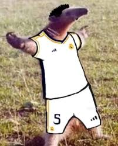

# P2 do módulo 6
Identificar todas as faces presentes no primeiro plano de um vídeo de teste.
---


Para ver o video de demonstração [clique aqui](https://drive.google.com/file/d/1aHC_g3sirIszAARxdUwIU6AOx_OYZzrn/view?usp=sharing)

---
# Execução

1. Clone o repositório:
```bash
git clone https://github.com/rafaelarojas/teleop2
```

2. Crie uma Venv:
```bash
python3 -m venv venv
```

3. Ative a Venv:
```bash
source venv/bin/activate
```

4. Instale as dependências do arquivo `requirements.txt`
```bash
pip install -r requirements.txt
```

5. Certifique que o [OpenCV](https://opencv.org/) está instalado:
```bash
pip install cv2
```

6. Por fim, para executar o arquivo rode o comando:
```bash
python3 main.py
```

---
### Perguntas técnicas 

2.1
O método de detecção escolhido foi o **Haar Cascade**.
O Haar Cascade é baseado em características de Haar, que são padrões visuais simples, como bordas, linhas e variações de intensidade em uma imagem. Cada característica é representada por um grupo de retângulos pretos e brancos adjacentes. Para calcular rapidamente essas características, o algoritmo utiliza uma estrutura chamada Imagem Integral. A Imagem Integral permite que qualquer soma de pixels em um retângulo da imagem seja calculada em tempo constante. Além disso, o Haar Cascade emprega o algoritmo AdaBoost para reduzir ainda mais a complexidade da classificação de imagens, identificando as características mais relevantes do objeto alvo e eliminando o restante. O Haar Cascade também aplica os elementos estruturais em cascata, o que ajuda a eliminar ainda mais os ruídos.


2.2

1 - **CNN**: A CNN é mais versátil, pois ela se adapta e aprende caracteristicas distintas. Além disso, na CNN compartilham os pesos dos filtros convolucionais em todas as regiões da imagem, o que permite que a rede aprenda padrões locais em diferentes regiões da imagem. Pode ser facilmente implementado usando TensorFlow, Pytorch. Sua versatilidade é alta visto que a CNN consegue aprender diferentes caracteristicas.

2 - **Haar Cascade**: O Haar Cascade é capaz de identificar diversos padrões dentro de uma imagem. Todavia, se, principalmente o ângulo ou iluminação (ou falta dela) for abrupto, o Haar Cascade pode não identificar um certo padrão na imagem. Sua implementação é simples utilizando o OpenCV, não é tão versátil quanto a CNN, pois fora do contexto de detecção de faces, sua eficácia de detecção não é tão precisa.

3 - **Correlação Cruzada**: a correlação cruzada envolve comparar duas imagens para determinar um grau de similaridade entre elas, fazendo a utilização de sinais, o que a torna inferior no quesito implementação que as demais. Além disso, a correlação cruzada se torna pouco versátil, pois se adapta a apenas características específicas de uma imagem para procurar em outra, ou seja, para detecção de faces no geral não é viável. 

4 - **NN**: A Rede Neural Linear é de fácil implementação, é mais rápida em questão de treino, visto que ela tem menos processos para serem treinados, sendo assim, seu tempo de resposta é maior. Entretanto, não é capaz de realizar a detecção de faces e se torna pouco versátil pela sua simplicidade, onde não é possível realizar muitas tarefas com uma Rede Neural Linear.


**2.3**

1 - **CNN**: As CNNs das listadas são as mais eficazes na detecção de emoções, pois podem aprender características complexas e sutis das expressões faciais Elas podem capturar variações nas expressões devido à sua capacidade de extrair diferentes níveis de características hierárquicas. Também pode ser implementado usando bibliotecas populares como TensorFlow e PyTorch. 

2 - **Haar Cascade**: Embora o Haar Cascade possa ser usado para detectar faces, ele não é tão eficaz para detectar emoções devido à falta de capacidade para capturar detalhes, nesse caso, expressões. Para implentar para detecção de emoções pode ser implementado com OpenCV mas  não será tão preciso.

3 - **Correlação Cruzada**: A correlação cruzada é eficaz para comparar padrões específicos, mas não é adequada para a detecção de emoções. Ademais, também não é apropriada para detectar nuânces, por ser uma implementação muito simples, além de iluminação e ângulação poder atrapalhar na detecção da emoção.

4 - **NN**: Rede Neural Linear é incapaz de capturar caracteristicas não lineares, como ela não consegue se quer detectar uma face, o intuito de detectar emoções em uma face através dela também se torna inválido.


**2.4**

As soluções listadas, por sí só, não possuem a capacidade de considerar as variações de um frame para outro, apenas o frame de maneira independente. Para ter uma consideração uma sequência temporal, pode-se utilizar RNN ou TSTM. Ambos são projetadas para lidar com dados sequenciais e podem ser usadas para capturar dependências temporais, que CNN, Haar Cascade, Correlação Cruzada e NN por sí só não têm essa capacidade temporal.


**2.5**


